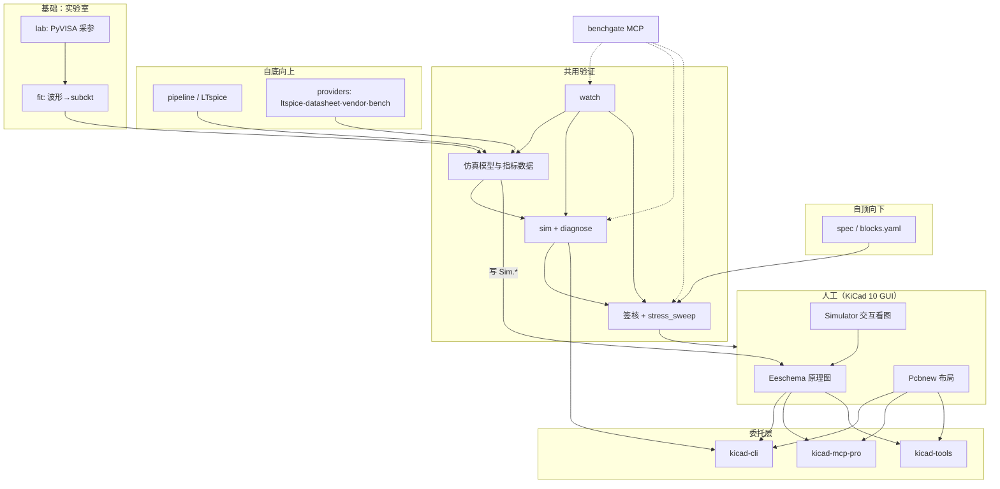

# benchgate 最小职责边界

> 硬件设计–验证闭环 · Python · Agent  
> 版本：0.1 · 目标读者：项目维护者、Agent 编排设计

项目要解决的根本问题与业务问题对照见 [README](../README.md) 开篇。

### 文档用语（与 README 一致）

| 正文 | 文件 / 命令 |
|------|-------------|
| 仿真模型与指标数据 | `models/manifest.yaml` |
| 子电路配置 | `models/blocks.yaml` |
| 签核报告 | `gate report` → `gate_report.json` |
| 仿真前网表检查 | `sim preflight` |

仿真模型与指标数据含 SPICE 绑定、来源、达成指标（metrics）及性能预算（spec），不单指 `.lib` 文件。

**当前原理图/网表后端**：KiCad 10（`kicad-cli`、`kicad-tools`）。benchgate 以设计工程目录为工作区，不绑定某一编辑器品牌；下文 KiCad 接口为实现细节。

---

## 1. 设计原则

1. **原理图/PCB 工程文件是设计真源** — 工程师在 EDA 工具中审核；Git 管理工程目录。
2. **不重复 EDA 已有能力** — 交互仿真、ERC/DRC GUI、符号 Simulation Model Editor 交给编辑器。
3. **不重复 MCP 生态已有能力** — Agent 改原理图/PCB、制造导出、布局辅助，优先委托编辑器侧 MCP（当前为 kicad-mcp-pro / kicad-tools）。
4. **benchgate 只做差异化** — 设计–验证闭环：实验室实测、局部仿真表征 → **仿真模型与指标数据** → ngspice 批跑 → **签核**。

### 1.1 设计–验证闭环

benchgate 支持从性能预算或从实测/局部仿真两种入口，汇入同一验证流程（详见 [README](../README.md)）：

| 层次 | 含义 | 主要模块 |
|------|------|----------|
| **基础** | 实验室测量与 Session | `lab/` · `instruments/` · `lab/fit` |
| **自顶向下** | 从性能预算驱动设计与签核 | `blocks.yaml` · `spec` · `pipeline/` · 签核（spec 比对） |
| **自底向上** | 从实测/局部仿真逐级集成 | `lab characterize` · `providers/` · `model build` |
| **共用验证** | 全局回归与签核 | `mapping/` · `sim/` · `gate/` · `watch/` |

全局仿真引擎只有 **ngspice**；LTspice、实验室实测等为**离线**模型来源。



---

## 2. 职责边界表

### 2.1 benchgate **必须做**（In Scope）

| 模块 | 层次 | 职责 | 产出 |
|------|------|------|------|
| `lab/` · `instruments/` | **基础** | PyVISA 采数、Session 存储 | `models/captured/sessions/<id>/` |
| `lab/fit` | **基础** | 拟合或 PWL → subckt | `~/.benchgate/models/subckt/*.lib` |
| `providers/` · `pipeline/` | **自底向上** | LTspice / datasheet / vendor / bench → ngspice subckt | subckt + `provenance` |
| `blocks.yaml` · `spec set` | **自顶向下** | 性能预算、`operating_point` | `ComponentMapping.spec` |
| `mapping/` | **共享** | 扫描符号，维护 manifest | ready / pending / unmapped |
| `sim/` | **共享** | kicad-cli 导网表 → fixup/preflight → `ngspice -b` → checks/stress | `reports/sim/` · `sim diagnose` |
| `gate/` | **共享** | metrics vs spec（fail）、工作点 vs valid_range（warn）、实测 vs 仿真 RMSE、可选 stress_sweep | `gate_report.json` |
| `watch/` | **共享** | 监听 KiCad + `blocks.yaml` / `blocks/*` 变更；可选 **auto_capture** | `watch once` / `watch loop` |
| `kicad/spice_fields` | **共享** | 写回 `Sim.*`；KiCad 10 用 **文本编辑**（`kicad sim-fields`），避免 `Schematic.save()` | 符号与 manifest 一致 |
| `agent/` · `mcp_server` | **共享** | dispatch 编排；**stdio MCP** 暴露 §8 工具集 | `benchgate mcp serve` |

### 2.2 benchgate **不做**（Out of Scope → 直接用 KiCad / 第三方）

| 能力 | 交给谁 | 原因 |
|------|--------|------|
| 交互式 ngspice 仿真、探针、波形 UI | KiCad Simulator | 内置 |
| 手工挂载厂商 SPICE 模型、Pin 映射 GUI | KiCad Simulation Model Editor | 内置 |
| 无源 R/C/L 自动生成 SPICE | KiCad 符号 Value | 内置 |
| ERC / DRC / BOM / Gerber | `kicad-cli` 或 kicad-mcp-pro | 成熟 |
| 可制造性、批次一致性评估 | `sim tolerance`（LHS/adaptive/sequential/auto、并行、粗→细、块级 MC、环境轴、mix）→ `gate report` yield 规则 | **已覆盖**（M1–M4） |
| Agent 加符号、拉线、改 PCB、布局 | kicad-mcp-pro / kicad-tools | 生态已有 |
| 符号库搜索、LCSC 询价 | kicad-mcp-pro `lib_*` | 非 benchgate 目标 |
| FreeRouting  autoroute | kicad-mcp-pro `route_*` | 非 benchgate 目标 |
| SI/PI/EMC 启发式检查 | kicad-mcp-pro `si_*` / `emc_*` | 可选旁路，非核心 |

### 2.3 **灰色地带**（委托 + 薄封装）

| 场景 | 策略 |
|------|------|
| 扫描工程有哪些符号缺 `Sim.Library` | `benchgate mapping sync` 读 `.kicad_sch`（kicad-tools） |
| 写 `Sim.Library` / `Sim.Name` / `Sim.Pins` | **KiCad 10**：`kicad sim-fields` 文本注入（`sim_fields_safe.py`）；读符号仍用 kicad-tools |
| 后台 SPICE 瞬态/AC | `benchgate sim run`；**不**调用 kicad-mcp-pro `sim_*`（避免双轨） |
| Agent 需要改 PCB 走线 | Cursor MCP 直连 kicad-mcp-pro；benchgate 不包一层 |
| 导出 SPICE 网表 | benchgate 直接调 `kicad-cli`；MCP 的 `export_spice_netlist` 仅作备选 |

---

## 3. 推荐依赖关系

```
benchgate (核心)
├── KiCad 10          … 人工 GUI + 内置 ngspice
├── kicad-cli         … 无头网表 / ERC（benchgate 直接 subprocess）
├── kicad-tools       … 读 sch、改 Sim.* property、manifest 扫描
├── ngspice           … 批跑（benchgate sim/runner）
├── PyVISA            … 实验室
└── kicad-mcp-pro     … 可选；Agent 改 sch/PCB 时由 Cursor 挂载，benchgate 不 import
```

**版本约束**

| 组件 | 最低版本 | 说明 |
|------|----------|------|
| KiCad | **10.0** | 内置 ngspice、CLI、IPC API |
| kicad-cli | 随 KiCad 10 | PATH 可执行 |
| kicad-tools | ≥ 0.13 | Python API + `kct` CLI |
| kicad-mcp-pro | ≥ 2.1（推荐 3.x） | MCP 独立进程，KiCad 10-first |
| ngspice | ≥ 43 | 与 KiCad 捆绑版兼容即可 |

---

## 4. KiCad 10 直接依赖接口清单

benchgate **应直接调用**（subprocess，不经过 MCP）：

### 4.1 原理图

| 命令 | 用途 | benchgate 场景 |
|------|------|------------|
| `kicad-cli sch export netlist -f spice -o OUT INPUT.kicad_sch` | 导出 SPICE 网表 | **sim 流水线主入口** |
| `kicad-cli sch export netlist -f spicemodel -o OUT INPUT.kicad_sch` | SPICE 模型网表 | 调试单器件 |
| `kicad-cli sch erc -o reports/erc.json --format json INPUT.kicad_sch` | ERC | 回归时可选检查 |
| `kicad-cli sch export bom -o OUT INPUT.kicad_sch` | BOM | manifest 补 MPN（可选） |
| `kicad-cli version --format about` | 版本探测 | CI 环境检查 |

网表 `--format` 可选值（KiCad 9+ CLI）：`kicadsexpr`（默认）、`kicadxml`、`spice`、**`spicemodel`**、`cadstar`、`orcadpcb2`、`pads`、`allegro`。

文档：[KiCad CLI — sch export netlist](https://docs.kicad.org/10.0/en/cli/cli.html)

### 4.2 PCB（仅可选 DRC 检查，非 benchgate 核心）

| 命令 | 用途 | benchgate 场景 |
|------|------|------------|
| `kicad-cli pcb drc -o reports/drc.json --format json INPUT.kicad_pcb` | DRC | Agent 改板后可选跑 DRC |
| `kicad-cli pcb export gerbers …` | Gerber | **不做**；交给 MCP 制造流程 |

### 4.3 KiCad GUI / IPC（benchgate 默认不用）

| 接口 | 说明 |
|------|------|
| Eeschema → Simulator | 工程师交互验证 |
| `kicad-python` IPC API | KiCad 10 需 GUI；PCB 为主。**benchgate 不依赖** |
| Simulation Model Editor | 工程师手工绑厂商模型 |

---

## 5. kicad-tools 直接依赖接口清单

benchgate **Python 代码内 import / subprocess**（无需 KiCad GUI）：

### 5.1 Python API（推荐）

| 接口 | 模块 | benchgate 用途 |
|------|------|------------|
| `load_schematic(path)` | `kicad_tools` | 解析 `.kicad_sch` |
| `Schematic(doc)` | `kicad_tools` | 遍历 `symbols`、`properties` |
| `Project.load("*.kicad_pro")` | `kicad_tools` | 工程级扫描 |
| `project.cross_reference()` | `kicad_tools` | sch↔pcb 一致性（可选） |
| 符号 property 读写 | `Schematic` / operations | **写 `Sim.Library` 等** |

示例：

```python
from kicad_tools import load_schematic, Schematic

doc = load_schematic("design/board/board.kicad_sch")
sch = Schematic(doc)
for sym in sch.symbols:
    ref = sym.reference
    lib_id = sym.lib_id
    sim_lib = sym.properties.get("Sim.Library", "")
```

### 5.2 CLI（`kct`，JSON 输出）

| 命令 | benchgate 用途 |
|------|------------|
| `kct symbols PROJECT.kicad_sch --format json` | mapping sync 输入 |
| `kct nets PROJECT.kicad_sch --net NETNAME` | 定位实测探针 net |
| `kct bom PROJECT.kicad_sch --format json` | manifest 补全 MPN |
| `kct erc PROJECT.kicad_sch` | 快速 ERC（wrapper kicad-cli） |
| `kct drc BOARD.kicad_pcb --mfr jlcpcb` | 可选 DRC |

### 5.3 kicad-tools MCP（**benchgate 不内置，Agent 可选挂载**）

若 Cursor 已挂载 `kicad-tools[mcp]`，以下工具与 benchgate 功能重叠，**优先 MCP、benchgate 不实现**：

| MCP 工具 | 说明 |
|----------|------|
| `analyze_board` | PCB 分析 |
| `get_drc_violations` | DRC |
| `export_gerbers` / `export_bom` | 制造 |
| `route_net` / `route_net_auto` | 布线 |
| `optimize_placement` | 布局 |
| `start_session` / `commit` / `rollback` | 事务性 PCB 编辑 |

---

## 6. kicad-mcp-pro 委托接口清单

benchgate **不 import** kicad-mcp-pro；由 **Cursor / Agent 客户端** 作为独立 MCP Server 挂载。  
下表标注 benchgate 工作流中的**推荐用法**。

### 6.1 MCP Profile 建议

| Profile | 何时用 |
|---------|--------|
| `simulation` | ⚠️ 与 benchgate `sim/` 重叠；**默认不用**，仅快速探针 |
| `schematic_only` | Agent 辅助改原理图拓扑 |
| `pcb_only` | Agent 辅助布局/布线 |
| `analysis` | DRC/ERC/quality gate |
| `minimal` | 只读 + 导出 |
| `agent_full` / `full` | 全流程 Agent（慎用，工具面过大） |

环境变量（摘录）：

```bash
KICAD_MCP_KICAD_CLI=/Applications/KiCad/KiCad.app/Contents/MacOS/kicad-cli
KICAD_MCP_NGSPICE_CLI=/opt/homebrew/bin/ngspice
KICAD_MCP_PROJECT_DIR=/path/to/benchgate/design/myboard
KICAD_MCP_PROFILE=analysis   # benchgate 并存时建议 analysis 或 pcb_only
```

### 6.2 推荐 Agent 委托（与 benchgate 互补）

#### 项目管理

| 工具 | 用途 |
|------|------|
| `kicad_set_project` | 绑定当前工程 |
| `kicad_get_project_info` | Agent 上下文 |
| `project_get_design_intent` | 设计意图 |

#### 原理图（Agent 改图，benchgate 不改拓扑）

| 工具 | 用途 |
|------|------|
| `sch_get_symbols` / `sch_get_connectivity_graph` | 读网表结构 |
| `sch_trace_net` | 查网络 |
| `sch_add_symbol` / `sch_add_wire` / `sch_route_wire_between_pins` | Agent 搭电路 |
| `sch_update_properties` | 改 Value/Footprint（**非 Sim.\*** 时） |
| `sch_annotate` | 位号整理 |

> **Sim.\*** 实测字段由 **benchgate** 写入，避免 Agent 与 lab 流水线冲突。

#### PCB（Agent 改板，人工 DRC）

| 工具 | 用途 |
|------|------|
| `pcb_get_board_summary` / `pcb_get_nets` / `pcb_get_ratsnest` | 读板 |
| `pcb_sync_from_schematic` | 初次同步 footprint |
| `pcb_add_track` / `pcb_add_via` / `pcb_move_footprint` | 布局布线 |
| `pcb_save` | 落盘 |
| `run_drc` / `pcb_quality_gate` | 改板后设计规则检查 |

#### 导出与校验（制造/release，非 benchgate）

| 工具 | 用途 |
|------|------|
| `run_erc` | ERC |
| `export_spice_netlist` | ⚠️ 备选；benchgate 优先 `kicad-cli` |
| `export_gerber` / `export_bom` / `export_manufacturing_package` | 制造 |
| `project_quality_gate` | 发布前总闸 |

#### 仿真（与 benchgate 重叠 — 默认禁用）

| 工具 | 策略 |
|------|------|
| `sim_run_transient` / `sim_run_ac_analysis` / `sim_run_operating_point` | **不由 MCP 调用**；统一走 `benchgate sim run` |
| `sim_add_spice_directive` | 仅工程师手工；benchgate 用 sidecar `config/sim_profiles.yaml` |

#### 库与采购（benchgate 不涉及）

`lib_search_symbols`、`lib_assign_lcsc_to_symbol`、`lib_get_bom_with_pricing` 等 — 按需给 Agent，不进 benchgate core。

---

## 7. 标准工作流（职责切分）

### 7.1 工程师日常设计

```
工程师在 KiCad 画原理图/PCB
  → 保存
  → （可选）KiCad Simulator 看图
  → Git commit
```

### 7.2 设计–验证闭环（benchgate）

```
基础（实验室）     自顶向下                    自底向上
lab 采数·Session   spec / blocks.yaml         lab characterize
      │                  │                    LTspice → pipeline
      └──── fit ─────────┼──── subckt + metrics ────┘
                         ▼
              manifest → sim (ngspice) → gate
                         │
              spec fail / range warn / RMSE → 迭代或签核
```

- **实验室**是闭环的物理测量层，服务于自底向上表征，也用于最终样机签核（实测波形 vs 仿真）。
- **自顶向下**不绕开自底向上：spec 写完后，仍需 LTspice 或 lab 产出 `metrics`，gate 才能判定。
- 两种方法可在同一份仿真模型与指标数据里混用（块 A 来自实验室实测、块 B 来自 LTspice）。

### 7.3 自顶向下（要求驱动）

```
1. 编写 models/blocks.yaml（spec + operating_point + valid_range）
2. 按 spec 在 LTspice 等工具调电路 → 导出 blocks/*.net + *.metrics.json
3. benchgate watch once  （或 pipeline sync → mapping sync → sim run → gate report）
4. 读 gate_report：spec_failures → 改电路或修订预算
```

Agent 入口：`pipeline_sync` · `watch_once` · `spec_set`（手工改 spec 时）。

### 7.4 自底向上（证据驱动）

| 表征手段 | 典型命令 | 产出 |
|----------|----------|------|
| 实验室实测 | `lab characterize` | Session + subckt + `provenance.metrics` |
| 局部仿真 | `model build`（ltspice / datasheet / vendor / bench）· `pipeline sync` | subckt + metrics + provenance |
| 厂商/手册 | `model build --provider vendor|datasheet` | subckt + provenance（mapping sync 可自动补 datasheet catalog） |

共性：`表征 → manifest → sim run → gate report`。

### 7.5 benchgate 后台编排（`watch once` / `watch loop`）

CLI 入口：**`benchgate watch once`** · **`benchgate watch loop`**（持续 poll + debounce）。

PlantUML 流程见 [README](../README.md) · [docs/diagrams/](../diagrams/)。

```
benchgate watch once
  → pipeline sync（若有 blocks.yaml：subckt + spec + metrics）
  → mapping sync（kicad-tools 读符号 + Sim.*；ensure_datasheet_models）
  → auto_capture（可选：pending SUBCKT → lab_capture；models/auto_capture.yaml）
  → sim run（kicad-cli export netlist -f spice → fixup/preflight → ngspice -b）
  → sim tolerance（可选：blocks.yaml 含 tolerances/environment；默认 strategy auto · jobs 4）
  → stress_sweep（profile 启用 stress_sweep 时）
  → gate report（spec + valid_range + RMSE [+ mc_tolerance yield] [+ stress_sweep 摘要]）
```

长跑 MC 前建议：**`benchgate blocks validate --design <dir> --profile <name>`**（校验路径、`tolerance_sim.tran_stop` vs `window_after`、MC 分层）。报告对比见 [README](../README.md)「报告对比与日常巡检」一节。

跳过开关：`--no-pipeline` · `--no-sim` · `--no-gate` · `--no-tolerance` · `--no-auto-capture` · `--auto-capture-dry-run` · `--tolerance-strategy` · `--tolerance-jobs` · `--tolerance-samples`。

故障排查：**`benchgate diagnose`** — sim + gate + lab 汇总与归因；仅仿真侧用 **`benchgate sim diagnose`**。

单独签核 stress 扫描：**`benchgate gate report --stress-sweep --profile <name>`**。

### 7.6 Agent 辅助（Cursor MCP）

**两个 MCP Server 并存**（职责不同）：

| Server | 挂载方式 | 职责 |
|--------|----------|------|
| **benchgate** | `benchgate-mcp`（conda 环境**绝对路径**） | §8 设计–验证闭环工具 |
| **kicad-mcp-pro** | PyPI / Cursor 配置 | 改 sch/PCB、制造导出 |

benchgate MCP 示例：[docs/examples/cursor-mcp.json](../examples/cursor-mcp.json)。

```
用户：「把 U3 周围去耦电容加到 4 颗并重新布局」
  → kicad-mcp-pro：sch_* / pcb_* 
  → run_drc / project_quality_gate
  → 工程师在 KiCad 打开审核

用户：「跑 charge_pump 仿真并解释失败原因」
  → benchgate MCP：sim_run · diagnose · gate_report

用户：「U5 的实测模型是否过期？」
  → benchgate：mapping_status / model_status / gate 报告
```

---

## 8. benchgate 自有 Agent 工具（最小集）

CLI 与子命令对应：`benchgate mapping sync` ↔ `mapping_sync`，`benchgate sim run` ↔ `sim_run`，等。  
完整命令索引见 [CLI_REFERENCE.md](CLI_REFERENCE.md) · PlantUML：[command-tree.puml](diagrams/command-tree.puml) · [command-flow.puml](diagrams/command-flow.puml)。

工具按闭环层次分组（不暴露 PCB 布线 → kicad-mcp-pro）。

**基础 · 实验室**

| 工具 | CLI | 说明 |
|------|-----|------|
| `lab_list` | `lab list` | 仪器 + 角色绑定 |
| `lab_read` | `lab read` | 标量读数（默认 dmm） |
| `lab_capture_waveform` | `lab capture` | scope 波形 → Session |
| `lab_capture` | `lab characterize` 内 | 采数 + 拟合 → subckt + manifest；默认重跑 sim+gate |
| `lab_compare_waveforms` | `lab compare` | session 波形 vs sim CSV |
| `lab_apply_model` | — | 写 Sim.* + manifest（Agent 专用） |
| `lab_query_sessions` | `lab query sessions` | 历史 Session |
| `lab_metric_series` | `lab query metric` | 跨会话指标序列 |
| `lab_metric_drift` | `lab query drift` | 指标漂移趋势 |

**自顶向下**

| 工具 | CLI | 说明 |
|------|-----|------|
| `spec_set` | `spec set` | 性能预算 `{metric: [min, max]}` |
| `pipeline_sync` | `pipeline sync` | `blocks.yaml` → subckt + spec/metrics |
| — | `blocks validate` | 校验 `blocks.yaml`（CLI only；长跑 MC 前） |
| `watch_once` | `watch once` | 变更 → pipeline → mapping → sim [→ tolerance] → gate |
| `watch_loop` | `watch loop` | 持续监听 + debounce |

**自底向上**

| 工具 | CLI | 说明 |
|------|-----|------|
| `model_build` | `model build` | Provider：`ltspice` · `datasheet` · `vendor` · `bench` |
| `model_status` | `model status` | source / valid_range / metrics / spec |

**共用验证**

| 工具 | CLI | 说明 |
|------|-----|------|
| `mapping_sync` | `mapping sync` | 扫描 KiCad → manifest |
| `mapping_status` | `mapping status` | ready / pending / unmapped |
| `sim_run` | `sim run` | ngspice 批跑 + checks + stress |
| `sim_stress_sweep` | `sim stress-sweep` | 扫描 stress 轴 |
| `sim_sweep` | `sim sweep` | 参数扫描 |
| `sim_block_sweep` | `sim block-sweep` | block testbench 参数扫描（无需 KiCad 工程） |
| `sim_cosim` | `sim cosim` | 固件 cosim（进阶） |
| `sim_diagnose` | `sim diagnose` | preflight / report / log（仅仿真侧） |
| `diagnose` | `benchgate diagnose` | sim + gate + lab 汇总；`attribution` 归因 |
| `sim_tolerance` | `sim tolerance` | MC：lhs/adaptive/sequential/auto；`--jobs`；粗→细；块级层 |
| `gate_report` | `gate report` | spec · valid_range · 波形 RMSE/标量 · rules；可选 `--stress-sweep` |

**MCP**

| 入口 | 说明 |
|------|------|
| `benchgate mcp serve` / `benchgate-mcp` | stdio MCP，暴露上表全部 `dispatch` 工具 |
| `benchgate agent tools` | JSON schema 列表 |
| `benchgate agent call` | 调试单工具 |

> **Preflight**：仅 CLI `sim preflight`（无独立 Agent 名）；`sim run` 内嵌 preflight。连接器 J* → info `connector_dropped`（非 error）。

### 8.1 自顶向下自动化（`models/blocks.yaml`）

Agent 只需维护 YAML + 网表文件，无需手工调用 `model_build` / `spec_set`：

```yaml
# design/models/blocks.yaml
version: 1
operating_point:
  vsupply_v: 5.0
blocks:
  - kicad_key: "Regulator:Buck::BUCK1"
    reference: U3
    source: blocks/buck.net          # 或 .cir；.asc 需本机 LTspice + spicelib
    sim_name: BUCK
    spec: {eff_pct: [90, 100]}
    metrics_file: blocks/buck.metrics.json
    valid_range: {vsupply_v: [4.5, 5.5]}
```

CLI：`benchgate pipeline sync` · `benchgate blocks validate` · Agent：`pipeline_sync` · 编排：`benchgate watch once` / `watch loop`（`--no-*` 可跳过步骤）。

watch 监听范围：`*.kicad_sch` · `*.kicad_pro` · `*.kicad_pcb` · `models/blocks.yaml` · `models/blocks/*.{net,cir,asc,*.metrics.json}`。

**auto_capture**（可选）：`models/auto_capture.yaml` 配置；pending SUBCKT 触发 `lab_capture`（未配置实验室仪器时 skip / dry-run）。

示例见 `docs/examples/blocks.yaml` · `docs/examples/cursor-mcp.json`。

---

## 9. 目录约定（KiCad 版）

```
benchgate/
├── design/                    # *.kicad_pro 工程（Git 真源）
├── models/
│   ├── manifest.yaml          # lib_id::value → spice 绑定 + 实测元数据
│   ├── blocks.yaml            # Agent 自动化：本地块 spec/metrics/网表路径（§8.1）
│   ├── blocks/                # LTspice 导出 .net/.cir（或 .asc + LTspice）
│   ├── lab.yaml               # 项目级角色绑定 + capture 默认（可选，§12）
│   ├── auto_capture.yaml      # watch 自动 lab capture（可选）
│   ├── subckt/                # 项目本地 .lib（可选）
│   └── captured/sessions/<id>/ # Session（npz + csv + derived + session.yaml）
├── reports/                   # sim / gate / stress_sweep JSON
└── src/benchgate/
~/.benchgate/config/
├── instruments.yaml           # 全局仪器（§12）
├── sim_profiles.yaml          # profile：checks / stress / stress_sweep
├── stress_limits.yaml         # 器件应力上限
├── datasheet_models.yaml      # DatasheetModelProvider catalog
└── …
```

### manifest 键名（KiCad · version 2）

```yaml
# 示例：自底向上（实验室实测）+ spec（自顶向下）可并存
- kicad_key: "Amplifier_Operational:LM358::LM358"
  reference: "U3"
  spice_kind: subckt
  sim_library: "subckt/LM358_MEAS.lib"
  sim_name: "LM358_MEAS"
  sim_pins: "1=+ 2=- 3=OUT 4=V+ 5=V-"
  spec:                        # 自顶向下：性能预算
    gbw_hz: [1.0e6, .inf]
  provenance:
    source: bench              # bench | ltspice | datasheet | vendor | manual
    metrics: { gbw_hz: 1.2e6 } # 自底向上：实际达成
    valid_range:
      vsupply_v: [3.0, 32.0]
    measured:                  # source=bench 时的 Session 明细
      captured_at: "2026-06-08T12:00:00Z"
      session_id: "20260608T120000Z_ab12"
      params: { tau_s: 1.2e-4 }
  status: ready
```

`gate`：`metrics` vs `spec` → **fail**；`operating_point` vs `valid_range` → **warn**。详见 [RFC §10](RFC_LOCAL_SIM_MODEL_PROVIDER.md#10-扩展自顶向下-spec--metrics-闭环v03待评审)。

---

## 10. 迁移检查表（自 AD 骨架）

| 原 AD 模块 | KiCad 10 处置 |
|------------|---------------|
| `ad/reader.py` | 删除 → `kicad/project.py`（kicad-tools） |
| `ad/library.py` | 删除 → `kicad/spice_fields.py` |
| `pcb/editor.py`（altium-monkey） | 删除 → 委托 kicad-mcp-pro |
| `sim/netlist.py` | 保留逻辑；输入改为 kicad-cli spice 网表 |
| `mapping/engine.py` | 保留；键名改为 `kicad_key` |
| `lab/*` | 保留 |
| `agent/tools.py` | 收缩为 §8 最小集 |

---

## 11. Related work（竞品 / 生态对照）

**结论：目前没有与 benchgate 完整对标的 KiCad 插件或产品。** 生态中存在若干**局部重叠**的工具；**「PyVISA 实测 → 拟合 → 写回 `Sim.*` → 设计变更触发后台回归 → manifest 审计」** 整链仍为空白。

### 11.1 能力对照总表

| benchgate 能力 | 是否已有类似方案 |
|------------|------------------|
| KiCad 内置 GUI 仿真 | ✅ KiCad 自带（§2.2 委托，非竞品） |
| 手工绑厂商 SPICE 模型 | ✅ Simulation Model Editor（委托） |
| 厂商 / 社区 SPICE 模型库 | ⚠️ [KiCad-Spice-Library](https://github.com/kicad-spice-library/KiCad-Spice-Library)（脚本 + 仓库，非 PCM 插件） |
| Agent 改原理图 / PCB | ⚠️ [kicad-mcp-pro](https://pypi.org/project/kicad-mcp-pro/)、[kicad-tools](https://pypi.org/project/kicad-tools/)（MCP，非 KiCad 内嵌） |
| Agent + ngspice 批跑 | ⚠️ [spicebridge](https://pypi.org/project/spicebridge/)、kicad-mcp-pro `sim_*` |
| 数据手册 → SPICE | ⚠️ [datasheet2spice](https://github.com/lisiqi1983/datasheet2spice)（独立工具） |
| **示波器 PyVISA 采数** | ❌ KiCad 生态几乎无 |
| **实测波形 → subckt → 写回工程** | ❌ 无 KiCad 集成方案 |
| **manifest 缺模型审计** | ❌ 无 |
| **保存 / Git 触发自动回归** | ❌ 无 |

### 11.2 KiCad 官方与 PCM 插件

**与 benchgate 重叠（应委托，不重做）：**

- 内置 **ngspice** + **Simulation Model Editor** — 交互仿真、挂 `.lib`、配 `Sim.Pins`。

**名称相近、本质不同：**

| 项目 | 说明 | 与 benchgate 关系 |
|------|------|---------------|
| [kicad-breadboard](https://github.com/kerstensrobin/kicad-breadboard) | KiCad 9/10 插件；虚拟面包板 + **虚拟**示波器/信号源（教学） | 不接真实仪器；无关 bench 建模 |

**SPICE 相关、但不等于 benchgate：**

| 项目 | 说明 | 与 benchgate 关系 |
|------|------|---------------|
| [KiCad-Spice-Library](https://github.com/kicad-spice-library/KiCad-Spice-Library) | 集中 SPICE 模型库；`extractModels.pl` 按器件名抽取 | 外部脚本；README 提及「将来可能做成插件」；无实测、无 manifest |
| [Kicad-Simulation-library](https://github.com/eduardobehr/Kicad-Simulation-library) | 符号 + ngspice 子电路组织 | 偏库建设，非 lab 流水线 |

PCM 常见插件（Import-LIB、JLC 工具等）解决 **symbol / footprint / BOM**，与 benchgate 建模链无关。KiCad **不捆绑**第三方 SPICE 库，亦无 PCM 官方的「实测表征 / 自动挂载」插件 — 见 [KiCad SPICE](https://www.kicad.org/discover/spice/)。

### 11.3 独立工具与 MCP（非 KiCad 内嵌）

| 项目 | 重叠部分 | 与 benchgate 差距 |
|------|----------|---------------|
| [kicad-mcp-pro](https://pypi.org/project/kicad-mcp-pro/) | 改 sch/PCB、`export_spice_netlist`、`sim_run_*` | 无 PyVISA；无实测→模型；无 manifest（§6 委托） |
| [spicebridge](https://pypi.org/project/spicebridge/) | ngspice MCP、`create_model`（**数据手册参数**）、`export_kicad` | 从仿真 outward 到 KiCad，非设计过程中 inward 建模 |
| [kicad-tools](https://pypi.org/project/kicad-tools/) | 离线改 `.kicad_sch`/PCB、MCP 布局布线 | 无 lab、无 SPICE 回归链（§5 直接依赖） |
| [datasheet2spice](https://github.com/lisiqi1983/datasheet2spice) | PDF/曲线 → SPICE（MOSFET/二极管等） | 输入为数据手册，非 bench；不绑工程生命周期 |
| [jfet-model-maker](https://github.com/dvhx/jfet-model-maker) | **实测曲线 CSV → SPICE** | 仅 JFET；独立 ngspicejs；不接 KiCad |

**硬件闭环概念验证（非 KiCad 插件）：**

- [SPICE + Claude + 示波器（DEV）](https://dev.to/jtorchia/spice-claude-code-oscilloscope-when-the-agent-touches-the-physical-world-1a54)
- [Claude + lecroy-mcp + spicelib-mcp（Blog）](https://balamurali.in/blog/uncategorized/claude-code-mcp-spice-hardware-verification/)

证明「仿真 vs 实测对比」可行，但是 MCP 演示/博客，无 manifest、无 watch、无写 `Sim.*` 的产品化流程。

**仪器 HAL（benchgate `lab/` 可复用，非 KiCad 插件）：**

- [PyVISA](https://pyvisa.readthedocs.io/)、[py-lab-hal](https://github.com/google/py-lab-hal)、[conduit](https://github.com/wrongbaud/conduit) — 只管仪器，不管 KiCad 工程。

### 11.4 定位示意

```
                    强 KiCad 集成
                         ↑
    KiCad 内置仿真 ●     |     ● benchgate 目标
    kicad-mcp-pro  ●     |
    KiCad-Spice-Library ●|
                         |
    spicebridge ●        |
    硬件闭环 MCP ●       |
    datasheet2spice ●    |
    jfet-model-maker ●   |
                         ↓
    弱 bench ─────────────────────→ 强 bench / 实测
```

### 11.5 对 benchgate 的启示

1. **无直接竞品** — PCM 中不存在「benchgate 同款」；空白在 **bench → KiCad 工程闭环**。
2. **有可组合积木** — 复用 KiCad `Sim.*`、`kicad-cli`、`kicad-tools`、`kicad-mcp-pro`（Agent 改图）、PyVISA/conduit（仪器层）；见 §3–§6。
3. **差异化须守住** — PyVISA 采参、manifest、写回 `Sim.*`、后台 regression、sim vs bench gate；目前无人打包为 KiCad 工作流。

---

## 12. 仪器控制层（instruments / lab / store / analyze）

将 benchgate 从「仿真为主」扩展到「控制电子仪器 + 实测采数」。代码位于 `src/benchgate/instruments/` 与 `src/benchgate/lab/`。

### 12.1 架构

分层：**Transport（Bridge）→ Driver（Adapter）→ Capability（Protocol）**，经 Registry/Factory 实例化并绑定到逻辑角色。

```
Transport            Driver (adapter)        Capability (Protocol)     Role
─────────            ───────────────         ─────────────────────     ────
VisaTransport   ──>  DS1104Scope        ──>  Oscilloscope          ──>  scope
SerialTransport ──>  UT61EDmm           ──>  ScalarReader          ──>  dmm
SerialTransport ──>  TarsStimulus       ──>  DigitalStimulus       ──>  awg
SerialScpi      ──>  HtoolSA8           ──>  SpectrumAnalyzer +
                     (HTOOL SA8)             RFSource + VectorAnalyzer ──> sa / rfgen / vna
SerialTransport ──>  TinySA             ──>  SpectrumAnalyzer +
                     (tinySA USB)            RFSource              ──>  sa / rfgen
```

设计模式：Bridge（传输与驱动解耦，pyvisa/pyserial 懒加载）、Adapter（包装既有设备脚本）、Protocol（按能力拆分，不强制深继承）、Factory + Registry（`DRIVER_REGISTRY` + `load_bench`）。

- **Transport**：`VisaTransport`（SCPI）、`SerialScpiTransport`（CDC SCPI，如 SA8）、`SerialTransport`（被动遥测 / shell，如 UT61E、TARS、tinySA）。
- **能力按硬件真实情况拆分**：UT61E 只读（无 configure）；TARS 输出固定逻辑电平（`DigitalStimulus`，非模拟 AWG）；tinySA 有频谱 + 信号源、无 VNA；`PwmStimulus` 仅留接口（固件 `mcu tim` 仍为 stub）。

### 12.2 角色与三层配置

角色（`scope`/`dmm`/`awg`）是逻辑用途，映射到一台具体仪器。绑定优先级（高 → 低）：

```
CLI/Agent 参数(--scope/--dmm/--awg)  >  项目 <design>/models/lab.yaml  >  全局 ~/.benchgate/config/instruments.yaml
```

此外，**环境变量可覆盖仪器地址**（机器相关，与角色绑定正交）：

- `BENCHGATE_<ROLE>_ADDRESS` — 覆盖该角色所绑定仪器的地址
- `BENCHGATE_INSTRUMENT_<NAME>_ADDRESS` — 按仪器名覆盖（更具体，优先）

VISA 后端：默认 `ResourceManager()`（系统/NI-VISA；DS1104Z USB 实测仅此可用），可经 `defaults.visa_backend` 或单仪器 `options.visa_backend` 配置；不做双后端 fallback。配置样例见 `docs/examples/{instruments,lab}.yaml`。

### 12.3 数据类型与重试

- 统一数据类型：`Reading`（标量）、`Waveform`（波形）、`ScalarSeries`（标量序列）、`InstrumentInfo`（provenance 唯一真源）。
- **统一重试策略** `RetryPolicy`（默认 3 次 + 退避），对任意设备一致；耗尽抛 `InstrumentError`。过载/未触发等**语义状态**通过 `Reading.flags` 表达，不触发重试、不抛异常。

### 12.4 采集编排（lab/capture）

`LabSession` 按角色打开仪器；`capture_and_fit` 执行 RC 阶跃采数：

- 绑定 `awg`：TARS GPIO 置 idle → scope 武装单次 → 翻转产生 0→3.3 V 阶跃沿触发。
- 未绑定 `awg`：scope 武装，等待外部/手动激励。
- 同会话并行轮询 `dmm` 取稳态；拟合（scipy 可用时 `curve_fit`，否则 63.2% 估计回退）。

### 12.5 数据存储与查询（lab/store，S0）

一次采集 = 一个 **Session** 目录：`session.yaml` + 波形 `*.npz` + 标量 `*.csv` + `derived.json`。`LabDataStore` 提供两类沿时间轴查询：

- 单次采集内：`load_waveform` / `load_scalar_series`（支持时间窗）
- 跨会话：`list_sessions` / `metric_series`

S0 为纯文件层，无数据库；后续可叠加 catalog（jsonl/DuckDB）而不改 API。

### 12.6 分析（lab/analyze）

- 单次采集内：`crop` / `resample_uniform` / `align_waveforms` / `overlay` / `compare_waveforms`
- 跨会话：`metric_stats` / `drift`（线性趋势 slope/s）/ `compare_runs`

### 12.7 设备适配来源

| 设备 | 来源项目 | 迁移处置 |
|------|----------|----------|
| Rigol DS1104Z | adapter-osc-ds1104 | SCPI 序列 → `drivers/rigol_ds1104.py` |
| UNI-T UT61E | adapter-dmm-ut61e | ES51922 解析 → 纯 `UT61EDecoder` + `drivers/uni_t_ut61e.py`（修 `low_bat` bug） |
| TARS（STM32F429-Disc 固件） | tars | CDC shell `mcu gpio` → `drivers/tars_shell.py`（DTR + `tars>` 分帧） |
| HTOOL SA8 | — | CDC SCPI → `drivers/htool_sa8.py`（频谱 / TG / 标量 VNA） |
| tinySA | — | USB CDC console（产品名 `tinySA`）→ `drivers/tinysa.py`（`scanraw` 频谱 + `output`/`level`/`freq` 信号源） |

---

## 13. 参考链接

- [KiCad 10 介绍](https://docs.kicad.org/10.0/en/introduction/introduction.html)
- [KiCad CLI](https://docs.kicad.org/10.0/en/cli/cli.html)
- [KiCad SPICE / ngspice](https://www.kicad.org/discover/spice/)
- [kicad-tools PyPI](https://pypi.org/project/kicad-tools/)
- [kicad-mcp-pro PyPI](https://pypi.org/project/kicad-mcp-pro/)
- [ngspice + Eeschema 教程](https://ngspice.sourceforge.io/ngspice-eeschema.html)
- [KiCad-Spice-Library](https://github.com/kicad-spice-library/KiCad-Spice-Library)
- [spicebridge](https://pypi.org/project/spicebridge/)
- [datasheet2spice](https://github.com/lisiqi1983/datasheet2spice)
- [kicad-breadboard](https://github.com/kerstensrobin/kicad-breadboard)
