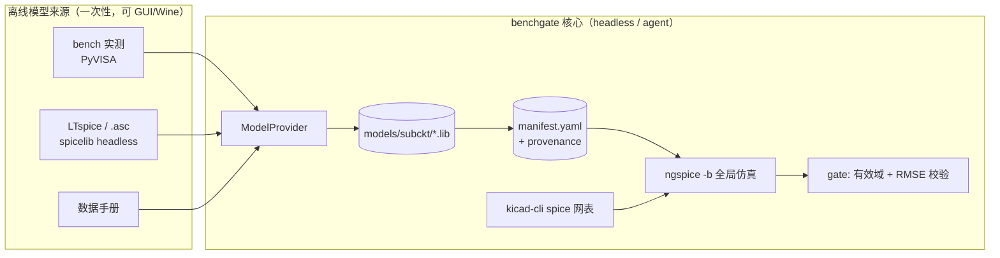
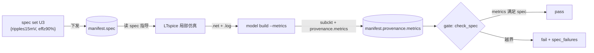

# RFC：局部仿真 → 模型提供者（ModelProvider）

> ngspice 全局引擎 + 局部他源模型（含 LTspice / `.asc`）
> 版本：0.2（评审通过；**不保留向后兼容**）· 目标读者：项目维护者、Agent 编排设计
> 关联：`docs/MINIMUM_SCOPE.md` §2.1（sim/gate/lab）、§8（Agent 工具最小集）

---

> **实现状态（v0.3）**：M0–M7 全部完成，74 测试通过。默认输入 `.net`/`.cir`；`.asc` 直采为可选进阶（需 LTspice+Wine）。自顶向下 spec/metrics 闭环已落地（§10）。

## 0. 结论摘要（TL;DR）

1. **ngspice 是唯一的全局仿真引擎**，负责整张原理图的批跑（沿用现有 `sim/` 流水线，不变）。
2. **「局部采用其他仿真」实现为「局部用他源生成模型工件」，而不是「局部挂另一个求解器」。** 即：离线模型交换，**不做运行时耦合协同仿真**。
3. **接口对接点锚定在 subckt 模型边界**（引脚 + 有效工作区间 + 来源出处），登记进 `manifest.yaml`——与现有实测 subckt（`measured`）同构，是它的自然泛化。
4. **LTspice 源的定位**：作为某个 `ModelProvider`（`LtspiceModelProvider`）的**输入**，生成局部块的 ngspice subckt；**不是**全局原理图的替代源。
   - ⚠️ **M0 实测修正（§5.1）**：`.asc` 直接入料在 macOS 需 LTspice 安装 + Wine（spicelib 依赖 `.asy` 符号库和 LTspice netlister）。**默认输入改为 LTspice 导出的 `.net`/`.cir` 网表**（headless、standalone、已验证 ngspice 跑通）；`.asc` 直采降级为可选进阶路径。

---

## 1. 决策：局部仿真 = 离线模型交换

### 1.1 被否决的方案：运行时耦合协同仿真（co-sim）

ngspice 与 LTspice 同时运行、在分区边界每步交换电压/电流。**不采用**，原因：

- 需自建混合仿真耦合引擎（边界受控源、时间步同步、界面收敛、代数环），工程量大且脆弱。
- LTspice 无 co-sim / stepping API；macOS 上无 `-netlist`、批处理能力弱，无法作为从属求解器驱动。
- 需活着的 LTspice 进程在环 → 不可复现、非 headless，违背 benchgate 的 agent-first / GUI 无价值原则。

### 1.2 采用的方案：模型交换（边界即模型）

用他源工具（LTspice、数据手册、厂商库……）**离线**表征某个子块，产出便携模型工件（拟合/导出的 subckt `.lib`），注入全局 ngspice 网表当 `X` 器件。子块只被离线跑一次生成模型，**全局仿真始终是纯 ngspice**。

这正是 benchgate 现有链路对**台架实测**在做的事（`lab/fit` → `models/subckt/*.lib` → `manifest` → `sim`）。本 RFC 只是把「模型工件的来源」从「bench 实测」泛化为「任意 provider」。



---

## 2. 核心抽象

三个新增数据结构 + 一个行为协议。命名与现有 `schemas.py` 对齐。

### 2.1 模型来源与出处（provenance）

```python
class ModelSource(str, Enum):
    BENCH = "bench"        # PyVISA 实测（现有 measured 归入此类）
    LTSPICE = "ltspice"    # 本地 LTspice / .asc 仿真导出
    DATASHEET = "datasheet"
    VENDOR = "vendor"      # 直接引用厂商 .lib（可能非实测/未验证）
    MANUAL = "manual"

@dataclass
class ModelProvenance:
    source: ModelSource
    generated_at: str                       # ISO8601
    tool: str | None = None                 # "LTspice 24.x" / "ngspice fit" / ...
    source_files: list[str] = field(default_factory=list)  # 如产出该模型的 .asc
    checksum: str | None = None             # 源文件/输入的溯源哈希
    valid_range: dict[str, Any] = field(default_factory=dict)  # 见 §3.2
    notes: str | None = None
    measured: MeasuredParams | None = None  # source=BENCH 时的实测明细（session/params/仪器）
```

> `ModelProvenance` 是现有 `MeasuredParams` 的泛化：bench 明细作为 `provenance.measured` 内嵌，不再是 `ComponentMapping` 的顶层字段。

### 2.2 模型工件

`ModelProvider` 的产出，等价于「一个可被 `sim/netlist.py` 注入的 subckt + 它的出处」。

```python
@dataclass
class ModelArtifact:
    lib_path: Path          # 落到 models/subckt/*.lib
    sim_name: str           # .subckt 名
    sim_pins: str | None    # 引脚映射，语义同 ComponentMapping.sim_pins
    provenance: ModelProvenance
```

### 2.3 ModelProvider 协议（行为）

与现有 `lab.fit` + `mapping.apply_measured_model` 同形；不强制深继承（Protocol）。

```python
class ModelProvider(Protocol):
    source: ModelSource
    def can_handle(self, entry: ComponentMapping) -> bool: ...
    def build(self, entry: ComponentMapping, *, workdir: Path) -> ModelArtifact: ...
```

- `BenchModelProvider`：包裹现有实测拟合链（重构而非重写）。
- `LtspiceModelProvider`：输入 `.asc`（+ 可选激励设定）→ `spicelib` headless netlist → 归一化为 ngspice subckt → 写 `.lib`。见 §5。

统一收口到一个薄函数（对应 CLI / agent 工具）：

```python
def build_model(manifest, entry, provider, *, subckt_dir) -> ComponentMapping:
    art = provider.build(entry, workdir=subckt_dir)
    entry.spice_kind = SpiceModelKind.SUBCKT
    entry.sim_library = art.lib_path
    entry.sim_name = art.sim_name
    entry.sim_pins = art.sim_pins
    entry.provenance = art.provenance
    manifest.upsert(entry)
    return entry
```

---

## 3. 边界契约

### 3.1 对接点在 subckt 边界，不在时间步边界

全局 ↔ 局部的接口是一个 **`.subckt`**：`{名称, 有序引脚, 有效工作区间, 出处}`。全局 ngspice 通过 `.include` + `X` 实例引用它（`sim/netlist.py::build_include_block` 已实现该注入，无需改动）。**不存在**跨引擎的运行时时间步交换。

### 3.2 有效域（valid_range）——分区正确性的安全阀

用降阶/离线模型替换子块，仅当该子块与外部**充分解耦**时才成立；端口负载/阻抗会影响结果，开关强耦合节点尤甚。因此模型工件**必须**声明其成立前提，例如：

**扁平区间形式**（每个维度是一个闭区间 `[min, max]`；开区间用 `null` 或 `.inf`；未列出的维度不校验）：

```yaml
valid_range:
  vsupply_v: [4.5, 5.5]
  freq_hz: [1.0, 1.0e6]
  temp_c: [-10, 85]
  load_ohm: [1.0e3, .inf]
```

`gate/` 接收一个**工作点** `operating_point`（同名维度的实测/仿真标量 dict，如 `{vsupply_v: 5.0, temp_c: 25}`），逐维校验：越界 → 告警；该维度无工作点值 → 记「无法验证」告警。这是把「静态 subckt 可能抓不住强耦合」这一风险显式化的安全阀（不静默）。工作点来源初期由 CLI/agent 显式传入，后续可从 sim profile 自动推断。

---

## 4. 对现有代码的改动点

原则：**加法为主，尽量不改现有行为**。

| 文件 | 改动 | 说明 |
|------|------|------|
| `schemas.py` | 新增 `ModelSource` / `ModelProvenance` / `ModelArtifact`；`ComponentMapping` 用 `provenance: ModelProvenance \| None` **取代**顶层 `measured` | 见 §4.1 |
| `io/manifest.py` | 序列化/反序列化 `provenance`（含内嵌 `measured`）；`manifest.version` = 2 | 不读旧格式 |
| `mapping/engine.py` | 新增 `build_model()`（§2.3）；`apply_measured_model` 改为 `BenchModelProvider` 的薄封装 | 现有 `sync` 逻辑不变 |
| `providers/`（新目录） | `base.py`(Protocol) / `bench.py` / `ltspice.py` | provider 实现 |
| `cli.py` / `agent/tools.py` | 新增 `model build` / `model status`（§7） | 复用现有 dispatch 风格 |
| `sim/netlist.py` | **不改** | 全局网表仍由 kicad-cli 产出；KiCad 导出特有的净名修正（`split_gate_drive_nets` / `inject_isense_path`）只作用于全局 KiCad 网表，与局部模型来源无关 |

### 4.1 `measured` → `provenance`（无向后兼容，直接切换）

- `ComponentMapping` 删除顶层 `measured` 字段，改用 `provenance: ModelProvenance | None`。
- bench 实测明细（`MeasuredParams`）内嵌为 `provenance.measured`，`source=BENCH`。
- `manifest.yaml` 只支持新格式（`version: 2`）；`load_manifest` 遇 `version < 2` 或顶层 `measured:` **直接报错**并提示重新 `mapping sync` / `model build`，不做兼容读取。
- 现有 `design/**/manifest.yaml` 若存在旧格式，由维护者重跑生成（本仓库当前无已落盘的旧 manifest 需迁移）。

---

## 5. LTspice 来源：LtspiceModelProvider

**定位**：LTspice 源是「一个待离线表征的子块」的输入，不是全局原理图源。

### 5.1 M0 spike 实测结论（2026-07，本机 macOS，无 LTspice 安装）

用 spicelib 1.6.2 + ngspice 46 实测，结论如下（推翻了「`.asc` 全程 headless」的假设）：

| 尝试 | 结果 |
|------|------|
| `AscEditor("rc.asc")` 解析 `.asc` | ❌ `FileNotFoundError: voltage.asy not found` —— spicelib 需要 LTspice 随附的 `.asy` 符号库才能解析 `.asc` |
| `AscEditor.save_netlist(...)` | 只能写回 `.asc`；写 `.net`/`.cir` 抛错，提示改用 `LTspice.create_netlist()` |
| `LTspice.create_netlist()` | 依赖 LTspice 二进制 `-netlist`；macOS 原生版**显式不支持**（源码 `raise ValueError`），且本机 `spice_exe=[]` 未装 |
| `SpiceEditor("rc.net")` 解析 `.net` | ✅ **完全 standalone**，无需 LTspice、无需 `.asy` |
| `ngspice -b rc.net`（含 `.control`） | ✅ 跑通，5091 行瞬态数据 |

**核心判断**：spicelib **不是**独立的 `.asc → netlist` 工具，而是 **LTspice 安装的包装器**——`.asc` 解析依赖 `.asy` 符号库，netlisting 依赖 LTspice 二进制（macOS 需 Wine）。因此**默认输入改为 LTspice 导出的 SPICE 网表 `.net`/`.cir`**（GUI `View → SPICE Netlist` 一次性导出），这条路真正 headless、LTspice 可选。

### 5.2 采用管线（默认）

```
.net/.cir  --spicelib SpiceEditor(可选)--> 解析/校验
           --dialect normalizer----------> ngspice 兼容网表
           --wrap .subckt----------------> models/subckt/<name>.lib  (+ ModelProvenance)
```

`.asc` 直接入料降级为**可选/进阶**路径，需 LTspice 安装（符号库）+ Wine（netlist），不在默认范围。

### 5.3 已知风险

1. **加密 LT/ADI 厂商模型**：ngspice **读不了**。→ benchgate 本就用实测/拟合 subckt 替换厂商模型，此短板在本语境被中和；provider 遇加密模型应**明确报错并提示改用 bench/datasheet 来源**，不静默产错。
2. **方言差异**：`.step`（ngspice 不支持，改 `.control`）、`standard.*` 内建模型映射、LTspice 私有原语。归一化层覆盖常见项，未覆盖的显式失败。

**依赖**：新增可选依赖组 `sim-ltspice = ["spicelib>=1.6"]`（对齐现有 `lab`/`agent`/`dev` extras）。核心链路不强依赖 spicelib（`.net` 也可用内置解析）。

---

## 6. 分阶段实现计划

| 里程碑 | 内容 | 验收 |
|--------|------|------|
| **M0 spike** ✅ | 装 `spicelib` 1.6.2；实测 `.asc`/`.net` 两条路 | **完成**：`.asc` 需 LTspice+Wine；`.net` standalone 且 ngspice 跑通（§5.1）。默认输入定为 `.net` |
| **M1 schema** ✅ | schema + manifest（无兼容，`version:2`） | **完成**：`provenance` 往返一致；旧格式报错；62→ 全绿 |
| **M2 provider** ✅ | `providers/{base,ltspice}.py` + `register_model()` | **完成**：`netlist_to_subckt`（提取/包裹）+ `LtspiceModelProvider`；6 单测；ngspice 全局引用跑通（vfinal=4.34V） |
| **M4 CLI/agent** ✅ | `benchgate model build/status` + `model_build`/`model_status` 工具 | **完成**：CLI + dispatch 往返验证 |
| **M3 gate** ✅ | `gate/` 读 `valid_range`（扁平区间），`operating_point` 越界告警 | **完成**：`check_valid_range` + `GateEntry.range_warnings/source`；CLI `gate report --operating-point`；3 单测 + CLI 端到端验证 |

M0 与 M1 可并行；M0 用真实用户 `.asc` 复跑以定盘方言差距。

---

## 7. CLI / Agent 工具面（预览）

对齐 `MINIMUM_SCOPE.md` §8「lab + sim + manifest」的最小集，新增 `model` 组：

| CLI | agent 工具 | 说明 |
|-----|-----------|------|
| `benchgate model build --ref U3 --provider ltspice --from block.asc` | `model_build` | 生成 subckt + 登记 provenance |
| `benchgate model status` | `model_status` | 各条目 source / valid_range / 是否越界 |

`--provider bench` 走实测链（与现有 `lab characterize` 等价，逐步统一）。

---

## 8. 风险与开放问题

1. **spicelib 的 `.asc` netlist 忠实度**（§5.1）——M0 定性；若默认参数缺失严重，可能要求随 `.asc` 提供 `.asy`/模型库路径。
2. **valid_range 谁来填**——初期人工/provider 估计；能否从仿真自动推断端口阻抗留待后续。
3. ~~`measured` 与 `provenance` 合并时机~~ —— 已定：直接合并，`measured` 内嵌进 `provenance`，无向后兼容（§4.1）。
4. **是否需要 `.asc` 作为「子块拓扑」被 KiCad 层引用**——当前 No（只作模型来源）；若将来要 `.asc` 直接参与全局拓扑，则是另一个 SchematicSource RFC，不在本 RFC 范围。

---

## 9. 待确认（评审后进入 M0/M1）

- [x] 确认「模型交换、非运行时耦合」为最终方向（§1）。
- [x] 确认边界契约 = subckt + valid_range + provenance（§3）。
- [x] 确认 `measured` 迁移策略：直接合并、无向后兼容（§4.1）。
- [x] 确认 `.asc` 仅作 provider 输入、不作全局源（§5）。
- [x] 确认分阶段顺序（§6）。

---

## 10. 扩展：自顶向下 spec / metrics 闭环（v0.3，待评审）

### 10.1 动机

M1–M4 打通的是**自底向上**：局部仿真 → 模型工件 → 全局 ngspice 引用。用户还需要**自顶向下**：

1. 全局环节给局部电路**限定性能指标**（spec / budget）；
2. 依据 spec 对局部电路仿真（如 LTspice）；
3. 仿真产出**实际性能指标**（metrics），回填到全局数据并与 spec 比对。

### 10.2 三个正交概念（务必区分，避免语义混淆）

| 概念 | 方向 | 落点 | 语义 | 违反后果 |
|------|------|------|------|----------|
| `spec` | 自顶向下（全局下发） | `ComponentMapping.spec` | 该块**必须达到**的性能目标 | 未达 → 设计**不合格**（fail） |
| `metrics` | 自底向上（局部产出） | `ModelProvenance.metrics` | 该块**实际达到**的性能 | —— |
| `valid_range` | 侧向（模型自述） | `ModelProvenance.valid_range` | 模型在何条件下**可信**（已实现 §3.2） | 越界 → 模型**不可信**（warn） |

关键：`spec` 不是 `valid_range`。前者是「要求」，后者是「适用域」。gate 对二者分别产出 **fail**（硬）与 **warn**（软）。

### 10.3 数据结构（扁平区间，与 valid_range 同形）

```python
# ComponentMapping 新增
spec: dict[str, list] | None = None        # {metric: [min, max]}，自顶向下的性能预算

# ModelProvenance 新增
metrics: dict[str, float] = field(default_factory=dict)  # 实际达成指标（泛化 bench 的 measured.params）
```

- `spec` 用与 `valid_range` 相同的扁平闭区间 `{name: [min, max]}`（开区间 `null`/`.inf`），复用同一套校验逻辑。
- `metrics` 是**规格比对的规范面**：无论来源（bench/ltspice/datasheet）都往这里写。bench 流程把关键 `measured.params` 同步进 `metrics`；`measured` 仍保留原始明细。

### 10.4 gate：spec vs metrics 门禁

`gate/report.py` 新增（与 `check_valid_range` 同款区间逻辑）：

```python
def check_spec(spec: dict, metrics: dict) -> list[str]:
    """返回不达标项；spec 维度在 metrics 中缺失 → 记「未表征，无法判定」。"""
```

`GateEntry` 增加 `spec_status: "pass" | "fail" | "n/a"` 与 `spec_failures: list[str]`；`summary` 增加 `spec_failures` 计数。**spec 比对自包含**（spec 与 metrics 都在 manifest 里），不需要 `operating_point`。

### 10.5 metrics 的来源

1. `--metrics '{"vout_ripple_mv": 12, "eff_pct": 92}'` 直传（最简，先支持）。
2. `--from-meas block.log`：解析 LTspice/ngspice `.MEAS` 结果日志为 `{name: value}`（可选，复用 spicelib `LTSpiceLogReader` 思路）。

### 10.6 CLI / Agent 工具面（新增）

| CLI | agent 工具 | 说明 |
|-----|-----------|------|
| `benchgate spec set --kicad-key K --spec '{...}'` | `spec_set` | 下发/更新某块的性能预算 |
| `benchgate model build … --metrics '{...}'` / `--from-meas x.log` | `model_build`（扩展参数） | 回填实际 metrics |
| `benchgate gate report`（无新参数） | `gate_report` | 报告体现 spec pass/fail + summary.spec_failures |

### 10.7 闭环示意



### 10.8 里程碑（续 §6）

| 里程碑 | 内容 | 验收 |
|--------|------|------|
| **M5 schema** ✅ | `ComponentMapping.spec` + `ModelProvenance.metrics` + manifest 往返 | **完成**：序列化一致（spec 在 entry、metrics 在 provenance）；bench 流程同步 `measured.params`→`metrics` |
| **M6 gate** ✅ | `check_spec` + `GateEntry.spec_status/spec_failures` + `summary.spec_failures` | **完成**：pass/fail/未表征三态单测 |
| **M7 CLI/agent** ✅ | `spec set` + `model build --metrics` + `spec_set`/`model_build` 工具 | **完成**：CLI 端到端 下发→回填→gate fail（eff 88<90）；`--from-meas` 日志解析延后 |

### 10.9 待确认（进入 M5 前）

- [x] `spec` 与 `metrics` 采用扁平区间 `{name:[min,max]}` / 标量 dict（§10.3）。
- [x] `spec` 挂在 `ComponentMapping`、`metrics` 挂在 `ModelProvenance`（§10.2）。
- [x] gate 中 spec 不达标为 **fail（硬）**，valid_range 越界为 **warn（软）**（§10.4）。
- [x] metrics 先支持 `--metrics` 直传，`--from-meas` 日志解析作为可选后续（§10.5）。
